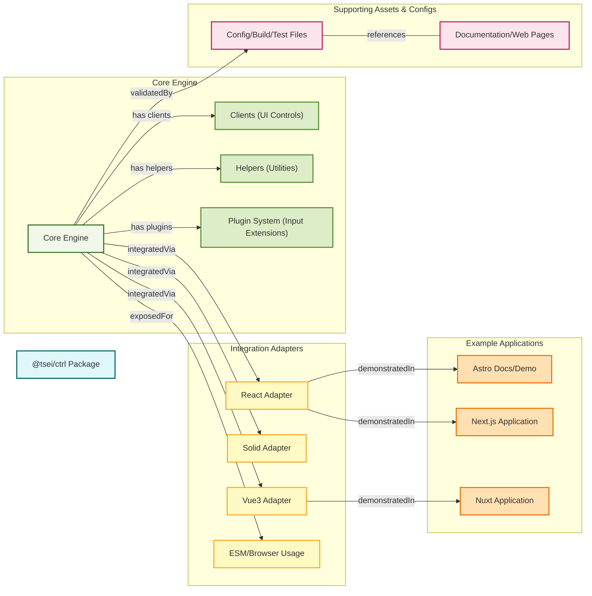

# @tsei/ctrl - UI Control Tool for Web Apps

<details>
<summary>

@tsei/ctrl is an open-source JavaScript library that provides a Figma-like controller interface for web applications.

</summary>

@tsei/ctrl は、Web アプリケーション向けに Figma ライクなコントローラーインターフェースを提供するオープンソース JavaScript ライブラリです。

</details>

<div align="center">

[](https://www.npmjs.com/package/@tsei/ctrl)
[](https://www.npmtrends.com/@tsei/ctrl)
[](https://github.com/tseijp/ctrl)
[](https://ctrl.tsei.jp/>)
[](https://bundlephobia.com/package/@tsei/ctrl@latest)

</div>

## 1. Usage

### 1.1 Installation

<details>
<summary>

Install the library using npm:

</summary>

npm を使用してライブラリをインストールします：

</details>

```bash
npm i @tsei/ctrl
```

### 1.2 Basic Usage

#### React

```tsx
import { useCtrl } from '@tsei/ctrl/react'
function App() {
        const { hello } = useCtrl({ hello: 'world' })
        return <div>{hello}</div>
}
```

#### Solid

```tsx
import { useCtrl } from '@tsei/ctrl/solid'
function App() {
        const c = useCtrl({ hello: 'world' })
        return <div>{c.hello}</div>
}
```

#### Vue

```html
<script setup>
import '@tsei/ctrl/style'
import { useCtrl } from '@tsei/ctrl/vue3'
const c = useCtrl({ hello: 'world' })
</script>
<template>
        {{ c.hello }}
</template>
```

#### ESM

```html
<div id="root">world</div>
<script type="module">
        import { ctrl } from 'https://esm.sh/@tsei/ctrl@latest/es2022'
        const c = ctrl({ hello: 'world' })
        c.sub(() => {
                document.getElementById('root').innerText = c.current.hello
        })
</script>
```

### 1.3 Using the Controller UI

#### React

```tsx
import '@tsei/ctrl/style'
import { Controller, useCtrl } from '@tsei/ctrl/react'
function App() {
        const { a, b, c } = useCtrl({ a: 0, b: 1, c: 2 })
        return (
                <Controller>
                        <ul>
                                <li>{a}</li>
                                <li>{b}</li>
                                <li>{c}</li>
                        </ul>
                </Controller>
        )
}
```

#### Solid

```tsx
import '@tsei/ctrl/style'
import { Controller, useCtrl } from '@tsei/ctrl/solid'
function App() {
        const c = useCtrl({ a: 0, b: 1, c: 2 })
        return (
                <>
                        <Controller />
                        <ul>
                                <li>{c.a}</li>
                                <li>{c.b}</li>
                                <li>{c.c}</li>
                        </ul>
                </>
        )
}
```

#### Vue

```html
<script setup>
import '@tsei/ctrl/style'
import { Controller, useCtrl } from '@tsei/ctrl/vue3'
const c = useCtrl({ a: 0, b: 1, c: 2 })
</script>

<template>
        <Controller />
        <ul>
                <li>{c.a}</li>
                <li>{c.b}</li>
                <li>{c.c}</li>
        </ul>
</template>
```

#### ESM

```html
<link rel="stylesheet" href="https://esm.sh/@tsei/ctrl@latest/dist/index.css" />
<script type="module" src="https://esm.sh/tsx"></script>
<script type="text/babel">
        import {
                Controller,
                ctrl,
        } from 'https://esm.sh/@tsei/ctrl@latest/es2022/index.mjs'
        const c = ctrl({ a: 0, b: 1, c: 2 })
        /** @jsx ctrl.create */
        ctrl.append(
                <Controller>
                        <ul>
                                <li>{a}</li>
                                <li>{b}</li>
                                <li>{c}</li>
                        </ul>
                </Controller>,
                document.body
        )
        c.sub((key) => {
                document.getElementById(key).innerText = c.current[key]
        })
</script>
```

</details>

## 2. What is This

### 2.1 Overview

<details>
<summary>

The library is designed to control JavaScript values through any interfaces, enabling manipulation of object parameters through controller UI or WebRTC synchronization.

</summary>

このライブラリは任意のインターフェースを通じて JavaScript 値を制御するために設計されており、コントローラー UI や WebRTC 同期を通じてオブジェクトパラメータの操作を可能にします。

</details>

### 2.2 Features

<details>
<summary>

- **Diverse Input Types**: Support for various input types including numbers, vectors, colors, buttons, and more
- **Framework Integration**: Compatibility with React, Solid, Vue3, and ESM
- **Real-time Synchronization**: Synchronization between multiple clients using WebRTC
- **Data Persistence**: Data saving and restoration using IndexedDB
- **Extensible**: Custom input type addition through the plugin system

</summary>

- **多様な入力タイプ**: 数値、ベクトル、色、ボタンなど様々な入力タイプをサポート
- **フレームワーク統合**: React、Solid、Vue3、ESM との互換性
- **リアルタイム同期**: WebRTC を使用した複数クライアント間の同期
- **データ永続化**: IndexedDB を使用したデータの保存と復元
- **拡張可能**: プラグインシステムを通じたカスタム入力タイプの追加

</details>

## 3. How This is Built



### 3.1 Core Engine

<details>
<summary>

The core engine is the central component of the library, responsible for state management, event handling, and lifecycle management. It is provided through the `ctrl` function, which returns an object implementing the Ctrl interface.

</summary>

コアエンジンはライブラリの中心的なコンポーネントで、状態管理、イベント処理、ライフサイクル管理を担当します。`ctrl`関数を通じて提供され、Ctrl インターフェースを実装したオブジェクトを返します。

</details>

#### 3.1.1 Components

<details>
<summary>

- **Clients**: UI control components
     - Controller: Main container for the controller UI
     - ControlNav: Navigation bar at the top
     - ControlLeft: Left panel for layers
     - ControlRight: Right panel for plugins

</summary>

- **クライアント**: UI コントロールコンポーネント
     - Controller: コントローラー UI のメインコンテナ
     - ControlNav: 上部のナビゲーションバー
     - ControlLeft: 左側のレイヤーパネル
     - ControlRight: 右側のプラグインパネル

</details>

<details>
<summary>

- **Helpers**: Utility functions
     - drag: Drag event handling
     - sync: Real-time synchronization using WebRTC
     - save: Data persistence using IndexedDB
     - node: DOM operations
     - wheel: Wheel event handling

</summary>

- **ヘルパー**: ユーティリティ関数
     - drag: ドラッグイベント処理
     - sync: WebRTC を使用したリアルタイム同期
     - save: IndexedDB を使用したデータ永続化
     - node: DOM 操作
     - wheel: ホイールイベント処理

</details>

<details>
<summary>

- **Plugin System**: Support for various input types
     - DefaultPlugin: Automatic selection of appropriate plugins based on value types
     - Various plugins: Number, Vector, Color, Button, etc.

</summary>

- **プラグインシステム**: 様々な入力タイプのサポート
     - DefaultPlugin: 値の型に基づいて適切なプラグインを自動選択
     - 各種プラグイン: 数値、ベクトル、色、ボタンなど

</details>

### 3.2 Framework Integration

<details>
<summary>

Framework integrations provide interfaces for using @tsei/ctrl with different frameworks:

- **React**: Using hooks and context
- **Solid**: Using signals and context
- **Vue3**: Using reactivity and provide/inject
- **ESM**: Using direct DOM manipulation

</summary>

フレームワーク統合は、@tsei/ctrl を異なるフレームワークで使用するためのインターフェースを提供します：

- **React**: フックとコンテキストを使用
- **Solid**: シグナルとコンテキストを使用
- **Vue3**: リアクティビティと provide/inject を使用
- **ESM**: 直接 DOM 操作を使用

</details>

## 4. What This Can Do

### 4.1 Core Features

#### 4.1.1 Control Object

```ts
export interface Ctrl<T extends Target = Target> {
        get parent(): null | Ctrl
        set parent(parent: Ctrl)
        get id(): string
        set id(id: string)
        get current(): T
        writes: Set<Callback<T>>
        events: Set<Callback<T>>
        actors: Set<Function>
        mounts: Set<Function>
        cleans: Set<Function>
        mount(): void
        clean(): void
        sub(fn?: () => void): () => void
        get(): number
        act(): void
        set: Callback<T>
        run: Callback<T>
        ref(target: T | null): void
        cache: any
        isC: true
}
```

#### 4.1.2 Event Handling

<details>
<summary>

The library provides an event system for notification of value changes. Events are processed through multiple event sets.

</summary>

ライブラリは値の変更通知のためのイベントシステムを提供します。イベントは複数のイベントセットを通じて処理されます。

</details>

#### 4.1.3 Lifecycle Management

<details>
<summary>

Control objects have mount and cleanup phases. Initialization occurs during mount, and resource release occurs during cleanup.

</summary>

コントロールオブジェクトはマウントとクリーンアップのフェーズを持ちます。マウント時に初期化が行われ、クリーンアップ時にリソースの解放が行われます。

</details>

### 4.2 Input Types

<details>
<summary>

The library supports the following input types:

</summary>

ライブラリは以下の入力タイプをサポートします：

</details>

#### 4.2.1 Basic Types

<details>
<summary>

- **Number**: Support for direct values and uniform objects
- **String**: Support for text values
- **Boolean**: Support for truth values

</summary>

- **数値**: 直接値とユニフォームオブジェクトをサポート
- **文字列**: テキスト値をサポート
- **ブール値**: 真偽値をサポート

</details>

```ts
// Number
const c = ctrl({
        number0: 0, // or
        number1: { value: 1 },
})

// String
const c = ctrl({
        string0: 'HELLO', // or
        string1: { value: 'WORLD' },
})

// Boolean
const c = ctrl({
        boolean0: true, // or
        boolean1: { value: false },
})
```

#### 4.2.2 Composite Types

<details>
<summary>

- **Vector**: Support for array notation `[x, y, z]` and object notation `{x, y, z}`
- **Color**: Support for hex strings, RGB, HSL, CIE xyY
- **Button**: Support for click events
- **Select**: Support for dropdown selection

</summary>

- **ベクトル**: 配列表記`[x, y, z]`とオブジェクト表記`{x, y, z}`をサポート
- **色**: 16 進文字列、RGB、HSL、CIE xyY をサポート
- **ボタン**: クリックイベントをサポート
- **セレクト**: ドロップダウン選択をサポート

</details>

```ts
// Vector
const c = ctrl({
        vector0: [0, 0, 0], // or
        vector1: { x: 1, y: 1, z: 1 }, // or
        vector2: { value: [0, 0, 0] }, // or
        vector3: { value: { x: 1, y: 1, z: 1 } },
})

// Color
const c = ctrl({
        color0: '#fff', // or
        color1: { r: 1, g: 1, b: 1 }, // or
        color2: { h: 0, s: 0, l: 100 }, // or
        color3: { Y: 1, x: 1, y: 1 }, // or
        color4: { value: '#fff' }, // or
        color5: { value: { r: 1, g: 1, b: 1 } }, // or
        color6: { value: { h: 0, s: 0, l: 100 } }, // or
        color7: { value: { Y: 1, x: 1, y: 1 } },
})

// Button
const c = ctrl({
        button0: { onclick: () => console.log('CLICKED') }, // or
        button1: document.querySelector('button'), // or
        button2: { value: { onclick: () => console.log('CLICKED') } }, // or
        button3: { value: document.querySelector('button') },
})

// Select
const c = ctrl({
        select0: { options: ['#f00', '#0f0', '#00f'] }, // or
        select1: { options: document.querySelectorAll('option') }, // or
        select2: document.querySelector('select'), // or
        select3: { value: { options: ['#f00', '#0f0', '#00f'] } }, // or
        select4: { value: { options: document.querySelectorAll('option') } }, // or
        select5: { value: document.querySelector('select') },
})
```

#### 4.2.3 Media

<details>
<summary>

- **Audio**: Support for audio files
- **Image**: Support for image files
- **Video**: Support for video files

</summary>

- **オーディオ**: 音声ファイルをサポート
- **画像**: 画像ファイルをサポート
- **ビデオ**: 動画ファイルをサポート

</details>

```ts
// Audio
const c = ctrl({
        audio0: { src: '.wav' }, // or
        audio1: { value: { src: '.wav' } },
})

// Image
const c = ctrl({
        image0: { src: '.png' }, // or
        image1: { value: { src: '.png' } },
})

// Video
const c = ctrl({
        video0: { src: '.webm' }, // or
        video1: { value: { src: '.webm' } },
})
```

#### 4.2.4 Structural Types

<details>
<summary>

- **Nested**: Support for complex data structures
- **CSS**: Support for style properties

</summary>

- **ネスト**: 複雑なデータ構造をサポート
- **CSS**: スタイルプロパティをサポート

</details>

```ts
// Nested
const c = ctrl({
        nested0: { a: { b: { c: 0 } } }, // or
        nested1: { value: { a: { b: { c: 0 } } } }, // or
        nested2: { array: [0, 1, [2, 3]] }, // or
        nested3: { value: { array: [0, 1, [2, 3]] } },
})

// CSS Plugin
const c = ctrl({
        css0: { style: 'width:1280px; height:800px;' }, // or
        css1: { style: { width: '1280px', height: '800px' } }, // or
        css2: { value: { style: 'width:1280px; height:800px;' } }, // or
        css3: { value: { style: { width: '1280px', height: '800px' } } },
})
```

### 4.3 Advanced Features

#### 4.3.1 Data Persistence

<details>
<summary>

The library provides data persistence using IndexedDB through the `save` helper. This allows control values to be saved and restored across page reloads.

</summary>

ライブラリは `save` ヘルパーを通じて IndexedDB を使用したデータ永続化を提供します。これにより、ページのリロード間でコントロール値を保存・復元できます。

</details>

#### 4.3.2 Real-time Synchronization

<details>
<summary>

The library supports real-time synchronization using WebRTC through the `sync` helper. This allows control values to be synchronized across multiple clients, enabling collaborative editing and remote operation.

</summary>

ライブラリは `sync` ヘルパーを通じて WebRTC を使用したリアルタイム同期をサポートします。これにより、複数クライアント間でコントロール値を同期し、共同編集や遠隔操作が可能になります。

</details>

#### 4.3.3 HTML Element Control

<details>
<summary>

The library can control HTML elements directly by passing them as the target to the `ctrl` function. This allows for manipulating DOM element properties through the control interface.

</summary>

ライブラリは `ctrl` 関数のターゲットとして HTML 要素を直接渡すことで制御できます。これにより、コントロールインターフェースを通じて DOM 要素のプロパティを操作できます。

</details>

```ts
// HTMLElement
ctrl(document.body).sub()
```

#### 4.3.4 Three.js Integration

<details>
<summary>

The library can control Three.js objects and materials by passing them as the target to the `ctrl` function. This allows for manipulating 3D scene parameters through the control interface.

</summary>

ライブラリは `ctrl` 関数のターゲットとして Three.js オブジェクトやマテリアルを渡すことで制御できます。これにより、コントロールインターフェースを通じて 3D シーンのパラメータを操作できます。

</details>

```ts
// Uniforms
const uniforms = { uResolution: { value: [1280, 800] } }
const mat = THREE.MeshBasicMaterial({ uniforms })

ctrl(mat.uniforms).sub()
```

### 4.4 Value Update Methods

<details>
<summary>

The library provides several ways to update values:

- **Manual Update**: Using the `set` method to update values directly
- **Event Listening**: Adding listeners to be notified of value changes

</summary>

ライブラリは値を更新するための複数の方法を提供します：

- **手動更新**: `set`メソッドを使用して値を直接更新
- **イベントリスニング**: 値の変更を通知するためのリスナーを追加

</details>

```tsx
const c = ctrl({ hello: 'world' })

// Manual Update
const reset = () => {
        c.set('hello', 'world')
}

// Event Listening
const update = () => console.log(c.current.hello)
c.listeners.add(update)

function App() {
        const { hello } = useCtrl(c)
        return <button onClick={reset}>{hello}</button>
}
```

### 4.5 Application Examples

<details>
<summary>

The library can be used in various advanced scenarios:

- **DevTool**: Controlling HTML elements for development tools
- **r3f DevTool**: Controlling Three.js objects in React Three Fiber
- **HTMLElement**: Directly controlling DOM elements
- **Uniforms**: Controlling shader uniforms in Three.js

</summary>

ライブラリは様々な高度なシナリオで使用できます：

- **DevTool**: 開発ツール用の HTML 要素の制御
- **r3f DevTool**: React Three Fiber での Three.js オブジェクトの制御
- **HTMLElement**: DOM 要素の直接制御
- **Uniforms**: Three.js でのシェーダーユニフォームの制御

</details>

```tsx
// DevTool
const c = ctrl<HTMLDivElement>(null!)

function App() {
        return <div ref={c.ref}></div>
}

// r3f DevTool
const c = ctrl<THREE.MeshBasicMaterial>(null!)

function Box() {
        return (
                <mesh ref={c.ref}>
                        <boxGeometry />
                        <meshBasicMaterial />
                </mesh>
        )
}
```

## 5. How This Works

### 5.1 State Management

<details>
<summary>

The library uses a simple state management approach:

- Values are stored in the `current` property
- Updates are triggered through the `set` method
- Subscribers are notified through event sets

The state update flow is as follows:

```
set(key, value) → current[key] = value → events fired → actors executed
```

</summary>

ライブラリはシンプルな状態管理アプローチを使用します：

- 値は `current` プロパティに格納
- 更新は `set` メソッドを通じてトリガー
- サブスクライバーはイベントセットを通じて通知

状態更新のフローは以下の通りです：

```
set(key, value) → current[key] = value → events 発火 → actors 実行
```

</details>

### 5.2 Event Handling

<details>
<summary>

Event handling is done through multiple event sets:

- **events**: Triggered when values are set
- **writes**: Triggered when values are written
- **actors**: Functions to execute when values change
- **mounts**: Functions to execute when the control is mounted
- **cleans**: Functions to execute when the control is cleaned up

</summary>

イベント処理は複数のイベントセットを通じて行われます：

- **events**: 値が設定されたときに発火するイベント
- **writes**: 値が書き込まれるときに発火するイベント
- **actors**: 値が変更されたときに実行される関数
- **mounts**: コントロールがマウントされたときに実行される関数
- **cleans**: コントロールがクリーンアップされるときに実行される関数

</details>

### 5.3 Plugin System

<details>
<summary>

The plugin system is implemented around the `DefaultPlugin` function, which selects appropriate plugins based on the value type. The selection process follows these steps:

1. Check for custom plugins
2. Check for HTML collections
3. Check for objects with specific properties (color, vector, etc.)
4. Check for arrays
5. Check for primitive types

</summary>

プラグインシステムは `DefaultPlugin` 関数を中心に実装されており、値の型に基づいて適切なプラグインを選択します。選択プロセスは以下の順序で行われます：

1. カスタムプラグインのチェック
2. HTML コレクションのチェック
3. 特定のプロパティを持つオブジェクトのチェック（色、ベクトルなど）
4. 配列のチェック
5. プリミティブ型のチェック

</details>
