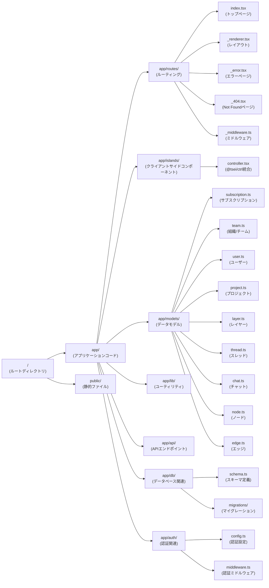
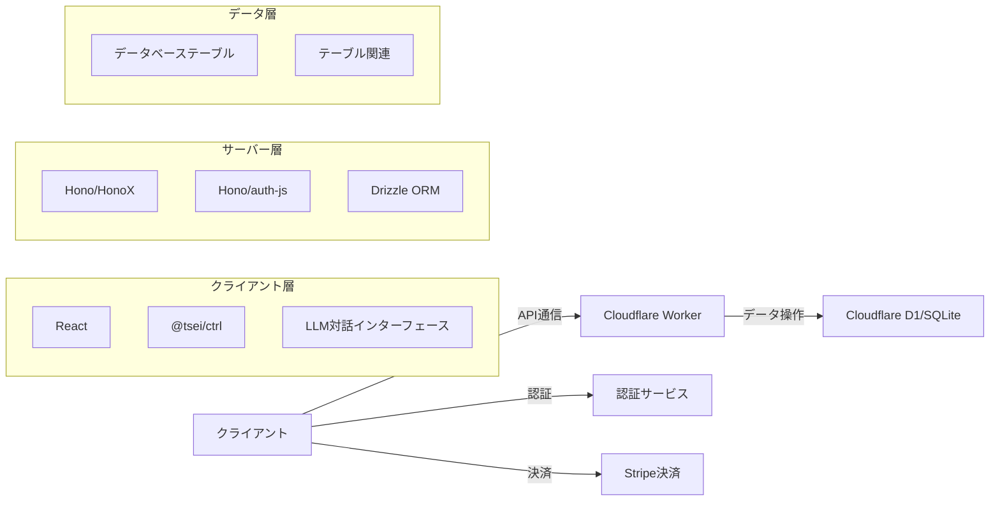
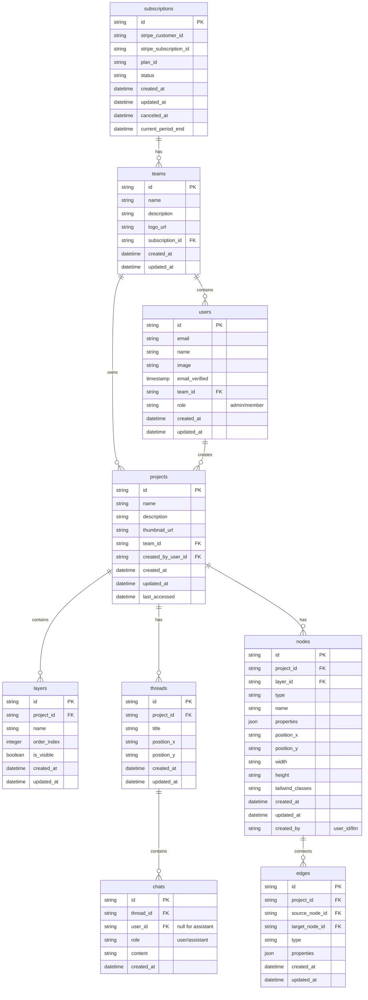
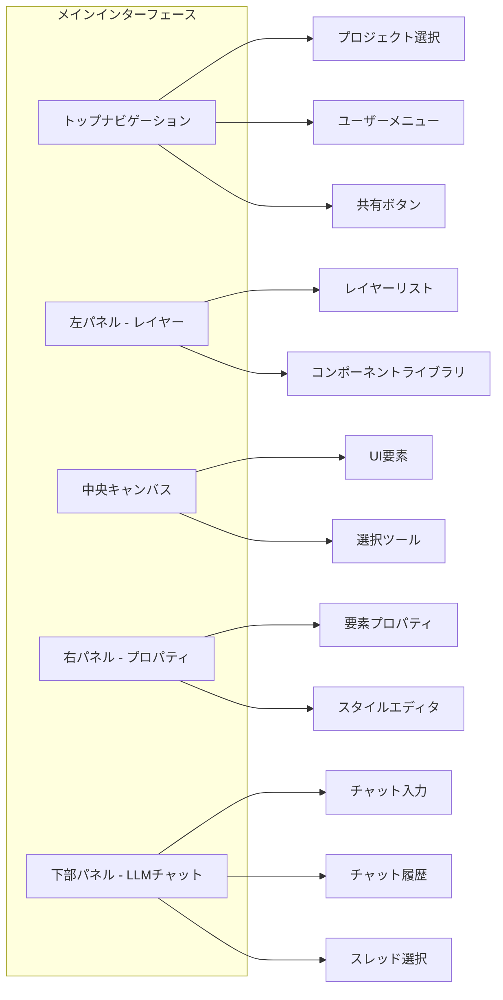
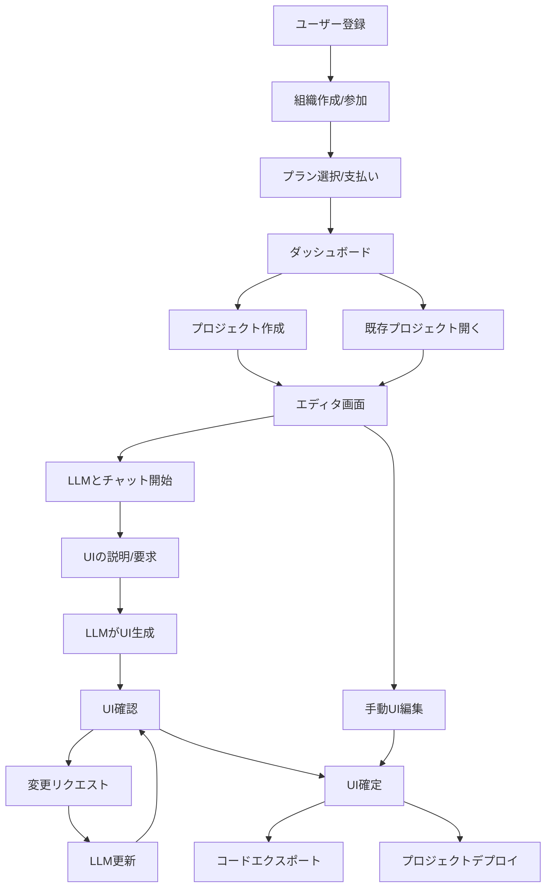

# Figma クローンサービス要件定義書

## 0. ディレクトリ構造



## 1. プロジェクト概要

### 1.1 背景と目的

@tsei/ctrl は、Web アプリケーションに Figma ライクなコントローラーインターフェースを提供するオープンソース JavaScript ライブラリである。このライブラリをベースに、Figma のクローンサービスを開発し、LLM との対話を通じて UI を開発できる革新的なプラットフォームを構築する。

### 1.2 プロジェクトの目標

1. @tsei/ctrl を活用した Figma ライクな UI を持つ Web サービスの開発
2. LLM との対話を通じた UI 開発体験の提供
3. 個人やチームでの共同作業を可能にするプラットフォームの構築
4. Cloudflare インフラを活用した高速で信頼性の高いサービスの提供
5. サブスクリプションモデルによる持続可能なビジネスモデルの確立

## 2. システム構成

### 2.1 技術スタック

#### 2.1.1 インフラ

- Cloudflare Workers: サーバーレスコンピューティング環境
- Cloudflare D1: SQLite ベースのサーバーレスデータベース
- SQLite: D1 で使用されるリレーショナルデータベース

#### 2.1.2 サーバーサイド

- Hono: 軽量で高速な Web フレームワーク
- HonoX: Hono のフルスタックフレームワーク拡張
- Hono/auth-js: 認証機能
- Drizzle: SQL クエリビルダー
- Drizzle-zod: スキーマ検証

#### 2.1.3 クライアントサイド

- React: UI ライブラリ
- @tsei/ctrl/react: Figma ライクなコントローラーインターフェース
- Zod: スキーマ検証
- @auth/core: 認証ライブラリ
- Tailwind CSS: UI スタイリング

### 2.2 システムアーキテクチャ



## 3. 機能要件

### 3.1 認証・アカウント管理

1. ユーザー登録・ログイン機能
2. ソーシャルログイン連携（Google, GitHub 等）
3. パスワードリセット機能
4. プロフィール管理機能
5. 契約単位でのユーザー管理（admin/member 権限）

### 3.2 契約・決済管理

1. Stripe を使用したサブスクリプション管理
2. 複数の料金プラン提供（個人/チーム/エンタープライズ）
3. 支払い履歴の表示
4. 請求書発行機能
5. プラン変更・キャンセル機能

### 3.3 プロジェクト管理

1. プロジェクト作成・編集・削除
2. プロジェクト一覧表示
3. プロジェクトメタデータ管理（名前、説明、サムネイル等）
4. プロジェクト共有・権限管理
5. プロジェクトのエクスポート・インポート機能

### 3.4 UI 開発環境

1. @tsei/ctrl を使用した Figma ライクなインターフェース
2. レイヤー管理システム
3. コンポーネントライブラリ
4. Tailwind CSS によるスタイリング
5. レスポンシブデザインプレビュー

### 3.5 LLM 対話機能

1. LLM とのリアルタイムチャットインターフェース
2. 対話履歴の保存・管理
3. LLM による UI 要素の生成・編集・削除
4. コードと視覚的 UI の同期表示
5. LLM へのコンテキスト提供（現在の UI 状態、選択要素等）

### 3.6 コラボレーション機能

1. リアルタイム共同編集（WebRTC 活用）
2. コメント・フィードバック機能
3. 変更履歴・バージョン管理
4. ユーザーアクティビティログ
5. 通知システム

### 3.7 デプロイ・エクスポート機能

1. 静的 HTML エクスポート
2. コードベースエクスポート（React, Vue 等）
3. デプロイ連携（Vercel, Netlify 等）
4. API エンドポイント生成
5. デザイン仕様書生成

## 4. データベース設計

### 4.1 テーブル構造



### 4.2 テーブル詳細

#### 4.2.1 subscriptions（サブスクリプション）

- Stripe との連携に必要な情報を保持
- 契約単位の基本テーブル
- 料金プラン、支払い状況、期間情報を管理

#### 4.2.2 teams（組織）

- 契約単位の組織情報
- 複数のユーザーが所属可能
- サブスクリプションとの紐付け

#### 4.2.3 users（ユーザー）

- ユーザー基本情報
- 所属組織と権限（admin/member）
- 認証情報と連携

#### 4.2.4 projects（プロジェクト）

- UI 開発プロジェクト
- チーム（組織）に所属
- 作成者情報を保持

#### 4.2.5 layers（レイヤー）

- プロジェクト内の表示レイヤー
- 表示順序と可視性を管理
- ページ切り替えに使用

#### 4.2.6 threads（スレッド）

- LLM との対話スレッド
- プロジェクト内の位置情報を持つ
- 複数のチャットを含む

#### 4.2.7 chats（チャット）

- LLM とユーザーの対話履歴
- ユーザーかアシスタント（LLM）かのロール情報
- スレッドに所属

#### 4.2.8 nodes（ノード）

- UI 要素の情報
- 位置、サイズ、プロパティ
- Tailwind クラス情報
- 作成者（ユーザーか LLM か）の情報

#### 4.2.9 edges（エッジ）

- ノード間の関連性
- アニメーションや相互作用の定義
- 接続元と接続先のノード ID を保持

## 5. ユーザーインターフェース設計

### 5.1 メインインターフェース



### 5.2 ユーザーフロー



## 6. API 設計

### 6.1 認証 API

- `POST /api/auth/register` - ユーザー登録
- `POST /api/auth/login` - ログイン
- `POST /api/auth/logout` - ログアウト
- `GET /api/auth/me` - 現在のユーザー情報取得
- `PUT /api/auth/profile` - プロフィール更新

### 6.2 組織・サブスクリプション API

- `POST /api/teams` - 組織作成
- `GET /api/teams` - 所属組織一覧
- `GET /api/teams/:id` - 組織詳細
- `PUT /api/teams/:id` - 組織情報更新
- `POST /api/teams/:id/members` - メンバー追加
- `DELETE /api/teams/:id/members/:userId` - メンバー削除
- `GET /api/subscriptions/:id` - サブスクリプション情報
- `POST /api/subscriptions` - サブスクリプション作成
- `PUT /api/subscriptions/:id` - サブスクリプション更新

### 6.3 プロジェクト API

- `POST /api/projects` - プロジェクト作成
- `GET /api/projects` - プロジェクト一覧
- `GET /api/projects/:id` - プロジェクト詳細
- `PUT /api/projects/:id` - プロジェクト更新
- `DELETE /api/projects/:id` - プロジェクト削除
- `POST /api/projects/:id/layers` - レイヤー作成
- `GET /api/projects/:id/layers` - レイヤー一覧

### 6.4 UI 要素 API

- `POST /api/projects/:id/nodes` - ノード作成
- `GET /api/projects/:id/nodes` - ノード一覧
- `GET /api/projects/:id/nodes/:nodeId` - ノード詳細
- `PUT /api/projects/:id/nodes/:nodeId` - ノード更新
- `DELETE /api/projects/:id/nodes/:nodeId` - ノード削除
- `POST /api/projects/:id/edges` - エッジ作成
- `GET /api/projects/:id/edges` - エッジ一覧
- `PUT /api/projects/:id/edges/:edgeId` - エッジ更新

### 6.5 LLM 対話 API

- `POST /api/projects/:id/threads` - スレッド作成
- `GET /api/projects/:id/threads` - スレッド一覧
- `POST /api/threads/:id/chats` - チャットメッセージ送信
- `GET /api/threads/:id/chats` - チャット履歴取得
- `POST /api/threads/:id/generate` - LLM による UI 生成
- `POST /api/threads/:id/update` - LLM による UI 更新

## 7. 環境設定

### 7.1 環境変数

アプリケーションの実行には以下の環境変数が必要です。`.env`ファイルまたはCloudflare Workersの環境変数として設定します。

#### 7.1.1 認証関連

- `AUTH_SECRET`: 認証用の秘密鍵（ランダムな文字列）
- `AUTH_URL`: 認証サービスのURL（例: https://example.com/api/auth）
- `GOOGLE_ID`: Google OAuth用のクライアントID
- `GOOGLE_SECRET`: Google OAuth用のクライアントシークレット

#### 7.1.2 データベース関連

- `DB`: Cloudflare D1データベース（Cloudflare Workersでは自動的にバインドされる）

#### 7.1.3 Stripe決済関連

- `STRIPE_SECRET_KEY`: Stripe APIキー
- `STRIPE_WEBHOOK_SECRET`: Stripe Webhook検証用のシークレット

#### 7.1.4 WebRTC (SkyWay) 関連

- `SKYWAY_APP_ID`: SkyWayアプリケーションID
- `SKYWAY_SECRET`: SkyWayシークレットキー

### 7.2 環境変数の初期化方法

環境変数は以下の方法で初期化されます：

1. **認証関連の環境変数**:
   ```typescript
   // app/auth/config.ts
   const env = {
     AUTH_SECRET: c.env.AUTH_SECRET || process.env.AUTH_SECRET,
     AUTH_URL: c.env.AUTH_URL || process.env.AUTH_URL || 'https://example.com/api/auth',
     GOOGLE_ID: c.env.GOOGLE_ID || process.env.GOOGLE_ID,
     GOOGLE_SECRET: c.env.GOOGLE_SECRET || process.env.GOOGLE_SECRET,
   };
   ```

2. **Stripe関連の環境変数**:
   ```typescript
   // app/lib/stripe.ts
   const apiKey = env?.STRIPE_SECRET_KEY || process.env.STRIPE_SECRET_KEY;
   ```

3. **WebRTC (SkyWay) 関連の環境変数**:
   ```typescript
   // WebRTC設定
   const config = {
     appId: SKYWAY_APP_ID,
     secret: SKYWAY_SECRET,
     roomName: 'your-room-name'
   };
   ```

### 7.3 開発環境のセットアップ

1. リポジトリをクローン
2. `.env.example`ファイルを`.env`にコピーし、必要な環境変数を設定
3. 依存パッケージをインストール: `npm install`
4. 開発サーバーを起動: `npm run dev`
